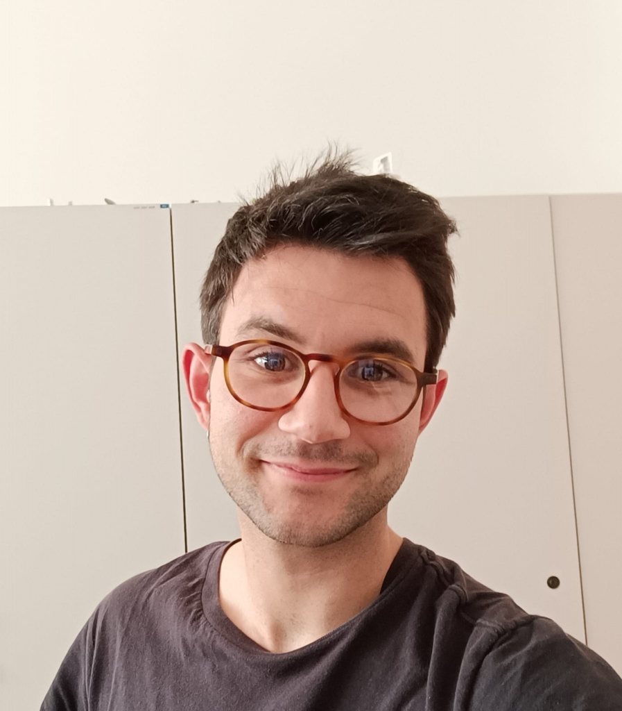

# Hi, I am Fabio Cevenini!

I am a postdoctoral researcher at the Applied Environmental and Energy Economics Lab (A3EL) at the University of Trento.   

I earned my PhD from the University of Trento in 2025. During my doctoral studies, I visited the emLab in Santa Barbara (CA) and the Choice Modelling Center in Leeds (UK). 

I am an environmental and resource economist. My econometric toolkit ranges from advanced choice modelling to causal inference, including specialized approaches such as generalized additive models.

My job market paper "The impact of climate change on fisheries" received the Italian Economic Association (SIE) Best PhD Dissertation Award and the IAERE Young Economist Award. 

I have also consulted for the UN Food and Agriculture Organization (FAO), designing and executing data collection and analysis for marine recreational fisheries.  
