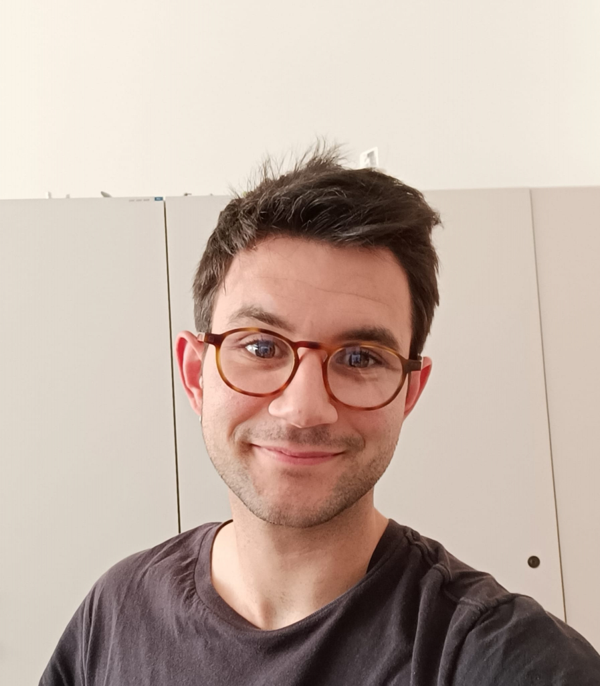

# Hi, I am Fabio Cevenini!

I am a postdoctoral researcher at the Applied Environmental and Energy Economics Lab (A3EL) at the University of Trento.

I earned my PhD from the University of Trento in 2025. During my doctoral studies, I visited the EmLab in Santa Barbara (CA) and the Choice Modelling Center in Leeds (UK). 

I am an environmental and resource economist. My econometric toolkit is broad, ranging from advanced choice modelling to causal inference, and including more specialized approaches such as generalized additive models.

On this website, you can find more about my research. Thanks for visiting!
